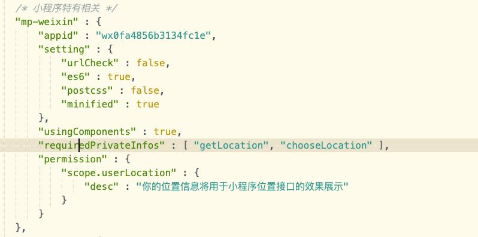

### liu-chooseAddress 适用于uni-app项目的仿美团新增地址选择模版
### 本组件目前兼容微信小程序、H5,完美仿照美团新增地址选择
### 本组件支持微信小程序、H5打开地图选择位置并修改完善地址等
### 如使用过程中有问题或有一些好的建议，欢迎qq联系：2364518038

### 引入插件后 
#### H5需要先在manifest.json 中web配置中添加腾讯地图key值
#### 小程序需先在manifest.json 中配置位置接口权限以及源码中添加"requiredPrivateInfos" : [ "getLocation", "chooseLocation" ]同时上线前需在[微信公众平台](https://mp.weixin.qq.com/)开发管理-接口设置开通相关api接口 

``` html
<liu-chooseAddress ref="liuChooseAddress" @submitAdd="submitAddress" @deteleAdd="deteleAddress">
</liu-chooseAddress>
```
``` javascript
export default {
	data() {
		return {
			// 'RBWBZ-CV5RW-VX7RW-36ZQL-YZVYF-DDBMM' 此处为作者为方便H5体验所留测试用key,可以用来体验，但请勿在项目内直接使用
		};
	},
	methods: {
		//添加地址成功回调
		submitAddress(data) {
			//拿到地址信息、表单数据、是否默认地址等
			console.log('添加调地址信息：', data)
		},
		//删除地址回调
		deteleAddress() {
			// 逻辑自行添加
		},
		//地址回显调用此方法
		editAddress() {
			let obj = {
				detailAddress: '',
				userName: '',
				userPhone: '',
				lableName: '',
				sexType: '',
				title: '',
				address: '',
				latitude: '',
				longitude: '',
				agreeState: ''
			}
			this.$refs.liuChooseAddress.setData(obj)
		}
	}
}
```